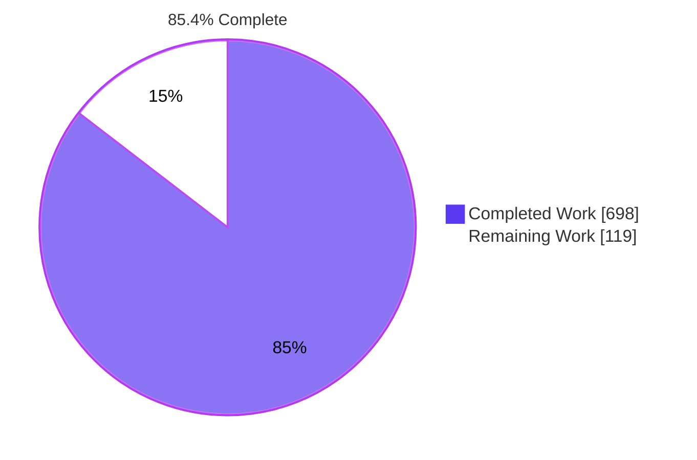
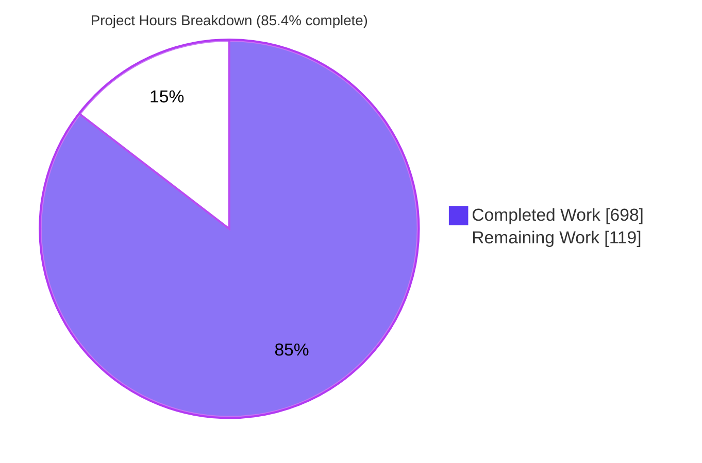
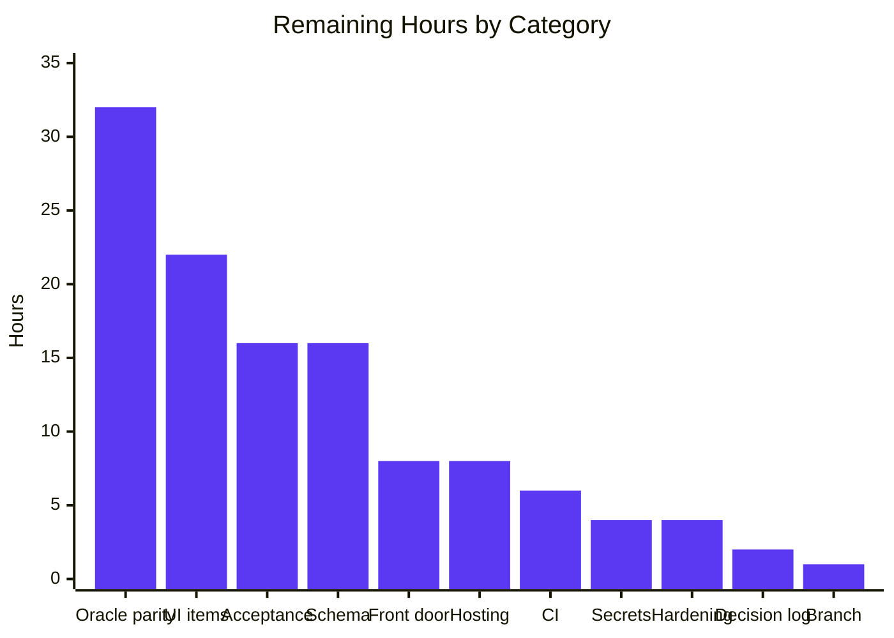

# 1. Executive Summary

## 1.1 Project Overview

SmallCashInvoice replaces the Oracle Forms cashier module `INV_SMALL_CASH` (`05_Complex/Inv_Small_Cash.xml`) with a .NET 10 and React 18 application for front-office cashiers who raise cash and credit invoices. Pricing, shares, VAT and numbering stay in the Oracle packages `BIL_INVOICE_ENGINE`, `BIL_INVOICE_API` and `BIL_IMPORT`, called through ODP.NET PL/SQL blocks. The Form's own rules (DR-01…DR-25) move to an isolated Domain library. Scope: five projects, two screens, a 19-operation REST API, four specification documents and a traceability-driven test suite. Authentication, deployment and execution against Oracle were out of scope.

## 1.2 Completion Status



| Metric | Value |
|---|---|
| Total Hours | 817 |
| Completed Hours (AI + Manual) | 698 (698 AI + 0 manual) |
| Remaining Hours | 119 |
| Completion | 698 / 817 = **85.4%** |

## 1.3 Key Accomplishments

- [x] Five-project solution builds with 0 warnings and 0 errors; Domain references no Oracle, Dapper or ASP.NET Core code
- [x] All 25 Form rules (DR-01…DR-25) pass 271 parity tests driven by 25 legacy-derived fixtures
- [x] Package access through PL/SQL blocks for preview, create, imports and reads, with no DDL and no Entity Framework
- [x] 19 REST operations with one error contract (422/415/404/500/501/503), exercised live
- [x] Invoice and MORE screens with 9 served pick lists, connectivity banner and open-item notices
- [x] 2,064 tests pass, 0 fail; Domain line coverage 99.82% against an 80% gate
- [x] 413-key bidirectional traceability matrix and 156-site error register enforced by compliance tests
- [x] Form specification, 58-item open-item register and 192-entry decision log in `docs/`

## 1.4 Critical Unresolved Issues

**21 items are open.** 17 sit inside the requested scope and touch 4 of the 37 plan requirements (UI behaviour, blur validation, explainability, branch name). 4 are verifications that need an Oracle instance.

| Issue | Impact | Owner | ETA |
|---|---|---|---|
| Oracle-executed verification (1): 25 package-parity and 6 binding tests have never run | Package calls, binds, OUT arrays and create commit are unproven | Data lead + DBA | 32 h |
| Schema-dependent confirmations (3): provisional bind widths (OI-15.01/02), Int32 offer ids (D-92), DR-03 day-versus-timestamp comparison (D-151) | Possible bind truncation, overflow or eligibility mismatch | Data lead | 16 h |
| UI behaviour (14): e.g. Save enabled on a blank draft, stale Totals after a cancelled discount alert, Bundle qty 0 does nothing | Cashier friction; no data corruption | Front-end lead | 22 h |
| Decision-log gaps (2): unlogged `InternalsVisibleTo`; three test files missing from the D-84 inventory | Explainability rule not fully met | Tech lead | 2 h |
| Branch name (1): `migration/small-cash-invoice` not used | Release process mismatch | Tech lead | 1 h |

## 1.5 Access Issues

| System/Resource | Type of Access | Issue Description | Resolution Status | Owner |
|---|---|---|---|---|
| HIS Oracle database with `BIL_*` packages | Database credentials and test schema | No connection string or test schema exists, so `[OracleFact]` tests skip and live calls cannot run | Open | DBA |

## 1.6 Recommended Next Steps

1. [High] Provision a seeded HIS test schema, set `ORACLE_TEST_CONNECTION` and run the 31 Oracle tests.
2. [High] Store `ConnectionStrings:HisOracle` and one shared `Invoicing:DraftSealKey` as secrets; put an authenticated front door before the `X-His-*` headers.
3. [High] Confirm bind widths, offer-id width and DR-03 semantics once schema DDL arrives.
4. [Medium] Close the 14 UI items, then run cashier acceptance against the Form.
5. [Medium] Add a CI gate and production hosting with TLS and health checks.

# 2. Project Hours Breakdown

## 2.1 Completed Work Detail

| Component | Hours | Description |
|---|---|---|
| Solution scaffold and configuration | 6 | `SmallCashInvoice.sln` with 5 projects, `global.json`, central package versions, `.gitignore`, `appsettings.json`, launch profiles 5080/5090 |
| Legacy Form specification | 64 | `docs/legacy-form-spec.md` §1–§10: construct inventory, trigger classification, rule catalogue, §8 error register (156 raise sites), §9 bidirectional matrix (413 forward keys), anomalies |
| Open items, decisions, architecture | 40 | `docs/dependency-open-items.md` (58 items, 55 schema objects, isolation record), `docs/decision-log.md` (192 decisions), `docs/architecture-decisions.md` §1–§4 |
| Domain layer | 48 | 15 model types, 17 rule classes for DR-01…DR-25, `InvoiceStatePolicy`, `OpenItemGate` (`src/Billing.Invoicing.Domain`) |
| Data: sessions and transactions | 24 | `OracleSession` (deadlines, savepoints, failure tracking), `OracleSessionFactory`, `InvoicingDataOptions` |
| Data: PL/SQL gateways and binders | 56 | `BilInvoiceApiGateway`, `BilImportGateway`, header (21 fields) and line (35 fields) binders, `OutputArrayReader`, `PlsqlBlocks`, `BoundedVarchar2` |
| Data: queries, pick lists, commands | 24 | `InvoiceQueries`, `LookupQueries`, `LovQueries` (8 lists), `PatientTransferCommand`, blocked open-item members |
| Data: Oracle error handling | 16 | `OracleErrorParser`, `OracleErrorCatalog`, `OracleFailureTranslator`, `DataFailure` |
| Api: workflow orchestration | 72 | `InvoiceWorkflowService` (validate, preview, replay-first create with pre-flight, imports, view, MORE) |
| Api: HTTP surface | 32 | 5 controllers, 19 contracts, operator-context middleware, ProblemDetails pipeline, CORS, data registration and draft seal |
| Web: static host and React client | 110 | Invoice and MORE screens, 8 components, draft state reducer, API client and types, `styles.css`, accessibility |
| Tests: Domain parity and unit | 40 | 18 parity classes over 25 DR fixtures; rule and model unit tests |
| Tests: Data unit | 36 | 13 classes: binders, readers, error catalogue, session deadlines, `LastInvoiceQuery` over SQLite |
| Tests: orchestration and API | 56 | 14 classes over hand-written `FakeDataPorts`: create, replay race, imports, error mapping, middleware |
| Tests: compliance and Oracle suites | 34 | Traceability matrix, error register, DDL scan, Domain isolation; 25 package-parity tests over 25 PR fixtures and 6 binding tests |
| Runtime verification | 40 | HTTP contract, browser flows, accessibility, security, performance and outage-path checks |
| **Total** | **698** | |

## 2.2 Remaining Work Detail

| Category | Hours | Priority |
|---|---|---|
| Oracle parity execution on a seeded HIS schema (31 tests, fixture re-keying, isolation record, fixes) | 32 | High |
| Schema-dependent confirmations: bind widths, offer-id width, DR-03 golden master | 16 | High |
| Production secrets and configuration (connection string, shared draft seal key, CORS origin) | 4 | High |
| Authenticated front door supplying the `X-His-*` operator headers | 8 | High |
| 14 open UI behaviour items | 22 | Medium |
| Decision-log completion (`InternalsVisibleTo`, three test files, D-84 count, SMS open-item list) | 2 | Medium |
| Publish on the `migration/small-cash-invoice` branch | 1 | Medium |
| CI pipeline running the whole-package gate | 6 | Medium |
| Production hosting: TLS, health checks, log sinks | 8 | Medium |
| Cashier acceptance testing side by side with the Form | 16 | Medium |
| Security hardening review (pre-flight check-to-commit window; full Oracle error text in parity-test logs) | 4 | Low |
| **Total** | **119** | |

## 2.3 Hours Calculation

- Completed: 698 hours, all autonomous; no manual hours recorded.
- Remaining: 119 hours (High 60, Medium 55, Low 4).
- Total: 698 + 119 = **817 hours**.
- Completion: 698 / 817 × 100 = **85.4%**.
- Confidence: high for UI, documentation and delivery items; low for the two Oracle categories (48 hours), whose size depends on how far live package behaviour differs from the fixtures.

# 3. Test Results

Full run of `dotnet test SmallCashInvoice.sln -c Release` at the branch tip: **2,095 tests, 2,064 passed, 0 failed, 31 skipped** (the skips are exactly the `[OracleFact]` tests). Category counts come from filtered runs that sum to the same 2,064.

| Area / Category | Framework | Tests | Passed | Failed | Coverage | What This Proves |
|---|---|---|---|---|---|---|
| Domain parity (`DomainParity`) | xUnit 2.9.3 | 271 | 271 | 0 | Domain line 99.82%, branch 99.71% | DR-01…DR-25 reproduce the Form's outcomes on 25 legacy-derived fixtures |
| Domain unit (`DomainUnit`) | xUnit 2.9.3 | 146 | 146 | 0 | (included above) | Rule classes, `InvoiceStatePolicy`, `OpenItemGate` and model types hold at their edges |
| Data unit (`DataUnit`) | xUnit + Microsoft.Data.Sqlite | 682 | 682 | 0 | Not measured | Binders, OUT-array readers, error catalogue and call deadlines behave; `LastInvoiceQuery` SQL runs on SQLite |
| Orchestration (`Orchestration`) | xUnit + `FakeDataPorts` | 941 | 941 | 0 | Not measured | Validate, preview, create (replay, pre-flight, open items), imports, controllers, middleware and the error contract behave over fake data ports |
| Compliance (`Compliance`) | xUnit | 24 | 24 | 0 | Not applicable | The 413-key traceability matrix and 156-site error register are complete; no DDL in source; Domain stays isolated |
| Oracle package parity (`OracleParity`) | xUnit `[OracleFact]` | 25 | 0 | 0 | Not applicable | Skipped: no `ORACLE_TEST_CONNECTION`; proves only that the suite compiles and gates itself |
| Oracle binding smoke (`OracleIntegration`) | xUnit `[OracleFact]` | 6 | 0 | 0 | Not applicable | Skipped for the same reason |
| React client build | TypeScript 5.9.3 strict + Vite 7.3.6 | 1 build | 1 | 0 | Not applicable | The client type-checks under `strict`/`noUnusedLocals` and bundles (289 kB JS, 30 kB CSS) |

Coverage gate: coverlet requires Domain line coverage ≥ 80% and passes at 99.82%.

**Not Covered**

- **Every Oracle round trip.** PL/SQL blocks, bind widths, OUT arrays, `CREATE_FULL_INVOICE` commit, the `dr21` savepoint rollback and `V_PAT_DATA` lock reads run only against fakes. Before release, run the 31 `[OracleFact]` tests on a seeded HIS schema.
- **The React client.** It has no automated tests and no JavaScript test runner. Its behaviour is shown only by browser walkthroughs (Section 4). Before release, run a cashier acceptance pass.
- **The ASP.NET Core HTTP pipeline end to end.** Controllers are tested directly, not through `WebApplicationFactory` (D-55). Model binding, CORS, body limits and static hosting are shown only by the live probes in Section 4.
- **Operations that answer 501 by design** (SMS, documents/print, stock transfer, saved-invoice edit). They cannot be tested until their open items are resolved.

# 4. Runtime Validation & UI Verification

Both hosts were run in Release on private ports with no Oracle instance, as the plan intends. The full create flow was driven in Chrome against the real controllers, with the data ports replaced by fakes.

- ✅ **Start-up.** Api and Web listen within seconds. With no connection string the Api starts and serves its contract. With a connection string but no `Invoicing:DraftSealKey`, it refuses to start: "Configuration value 'Invoicing:DraftSealKey' must be set…".
- ✅ **Operator context.** A request with no `X-His-*` headers gets 422 `operator-context-missing` naming all five. The client sends all five on every call, and the CORS preflight allows them.
- ✅ **Error contract without Oracle.** 500 `oracle-error` "not configured"; 503 `oracle-unavailable` in 0.26 s against an unreachable listener; 415 for `text/plain`; 404 for an unknown pick list; 422 for a missing pick-list bind; 405 for a wrong method; 422 `LINE` for a 1,001-line preview.
- ✅ **Open-item operations.** 501 `open-item` with OI-24 (`/api/lov/SERVICES`), OI-33 (`DOC1`) and OI-56 (`PATCH /api/invoices/{invNo}`).
- ✅ **Static Web host.** `/` returns 200, a deep route falls back to 200, a missing asset returns 404, and the preflight carries `Access-Control-Max-Age: 600`.
- ✅ **Invoice and MORE screens, offline.** "Front Office Cashier Invoice" renders the header form, lines grid, Totals, Payment and action bar. It shows the Oracle error alert, warnings for invoice types and currencies, and OI-33 notices on five fields. More → Return restores state and focus. No uncaught JavaScript exceptions. When the page is scrolled, the sticky outcome strip overlaps the lines-grid header row (cosmetic).
- ✅ **Connectivity banner.** On 503 the banner is fixed at the bottom with no retry button. It sends no automatic re-request over 25 s and does not overflow at 375 px.
- ⚠ **Draft, validate, preview and save, against fake data.** Verified: the doctor chain and claim number, payment status beside Save, DR-12 blocking Save, a held press on Save sending nothing, and a 201 turning the invoice read-only with OI-56 and OI-20. Partial: 14 UI items remain open (Section 1.4), and none of this has run against Oracle.
- ✅ **Accessibility.** Lighthouse accessibility and SEO score 100, axe finds 0 violations, and keyboard focus paths hold at 1280, 768 and 375 px.
- ⚠ **Oracle-backed flows were never exercised at runtime.** That covers live drafts, coverage, preview, create, imports, pick lists, the invoice view and last-invoice reads.

# 5. Compliance & Quality Review

## 5.1 Compliance Matrix

| Deliverable (plan section) | Benchmark | Status | Evidence |
|---|---|---|---|
| Solution, toolchain, pinned packages (0.4.1, 0.6.1) | Five projects; exact versions; no Entity Framework; no vulnerable packages | ✅ Pass | `SmallCashInvoice.sln`, `Directory.Packages.props`; `dotnet list … --vulnerable` clean; `npm audit` 0 |
| Domain isolation (G3) | No Oracle, Dapper, ASP.NET Core or sibling references | ✅ Pass | `tests/Billing.Invoicing.Tests/Architecture/DomainIsolationTests.cs` |
| Package logic stays in Oracle (G2) | No C# pricing, share, VAT, discount or numbering | ✅ Pass | `src/Billing.Invoicing.Data/Plsql/PlsqlBlocks.cs`; header and line binders |
| Form rules DR-01…DR-25 (0.3.2) | Verbatim texts; fixture parity | ✅ Pass | 17 classes in `src/Billing.Invoicing.Domain/Rules`; 271 parity tests |
| Error contract and open items (0.4.3, 0.6.2) | 422/415/404/500/501/503 shapes; OI-01…OI-58 | ✅ Pass | `src/Billing.Invoicing.Api/Errors/`; live probes (Section 4) |
| REST surface (0.4.4) | 19 operations, operator headers, create ordering and replay | ✅ Pass | 5 controllers in `src/Billing.Invoicing.Api/Controllers`; 941 orchestration tests |
| Client screens (0.4.8, 0.7.3) | Two screens, blur validation, banner, read-only after Save | ⚠ Partial (95%) | `ClientApp/src/screens/`; 14 open UI items |
| Traceability and error register (0.3.4, 0.3.5) | 413 forward keys and reverse keys; 156 raise sites | ✅ Pass | `docs/legacy-form-spec.md` §8–§9; Compliance 24/24 |
| Build, test and coverage gates (0.8) | 0 errors; Failed 0; skipped = `[OracleFact]`; Domain ≥ 80% | ✅ Pass | 2,064 passed, 31 skipped; 99.82% |
| No DDL; Minimal Change rule (0.8.6; Rule 2) | DDL grep empty; no existing file modified | ✅ Pass | `NoDdlInGeneratedSourceTests`; 239 files added, 0 modified |
| Documentation and UNVERIFIED labels (0.9, 0.11.2) | Four documents; Oracle claims labelled | ✅ Pass | `docs/*.md`; Data class summaries; `Verification=UNVERIFIED` traits |
| Explainability rule; branch (Rule 1; 0.11.4) | Every deviation logged; `migration/small-cash-invoice` | ⚠ Partial | Divergences 3 and 4 below |

## 5.2 AAP & Rule Divergences and Gaps

| What the AAP/Rule Required | What Was Delivered Instead | Why It Diverged | Impact | Remediation |
|---|---|---|---|---|
| 1. Configuration keys of 0.5.2 only; no secrets beyond the connection string | `Invoicing:DraftSealKey` secret and a `draftSeal` field on every draft (D-39, D-162) | Server-computed draft values had to be tamper-evident between calls | The Api will not start against Oracle without the key | Provision one shared key (Section 2.2) |
| 2. 503 for the listed connectivity codes (0.4.3) | ORA-50000 on open, and ORA-50201 with a socket cause, also return 503 (D-154) | ODP.NET reports a refused listener under these codes | Outage shows as the banner, not a 500 | Confirm against a real listener |
| 3. Explainability: every non-trivial decision logged; tests need no `InternalsVisibleTo` (0.5.2) | `InternalsVisibleTo` in `Billing.Invoicing.Data.csproj:13`; three test files outside D-84's 236-path inventory (tree adds 239) | Not recorded | Audit trail incomplete | Log or remove (2 h) |
| 4. Branch `migration/small-cash-invoice` from `main` (0.11.4, D-32) | Delivered on `blitzy-3f940699-6c85-4f36-a953-cad6a771fc7d` | Not recorded | Release tooling may expect the planned name | Publish or accept (1 h) |
| 5. Visit line requested on each doctor validation (0.4.8) | Not re-requested while an earlier visit line for the same key is on the draft (D-188) | A repeat request for an unchanged key would add a duplicate consultation line | Unchanged re-picks import nothing | Confirm in acceptance |
| 6. Hosting limited to the listed keys (0.5.2) | Extra log-level keys, a 10-minute preflight cache, a 1,000-line request cap, extra public types (D-75, D-76, D-84, D-176, D-177, D-179, D-180) | Log hygiene, payload bounds and contract clarity | Larger documented surface | None; review once |
| 7. SMS returns OI-12, OI-26, OI-45 (T081 row) | OI-12 and OI-45 (endpoint table; D-28) | The plan lists both sets | OI-26 not reported for SMS | Owner picks one (in the 2 h log task) |
| 8. Payment status shown beside Save (0.4.8) | A long status may start on the next row at 545–715 px widths (D-174) | Accepted to keep long text readable | Cosmetic at narrow widths | Accept or adjust in UI work |

**1 — Draft seal secret.** The plan's configuration lists only the connection string, application id, line cap, timeout and CORS origin. Server-computed draft values could be forged between calls, so the build seals them with an HMAC (`src/Billing.Invoicing.Api/Contracts/DraftDto.cs:39`; D-39). A non-empty `ConnectionStrings:HisOracle` now requires a base64 key of at least 32 bytes (`src/Billing.Invoicing.Api/Composition/InvoicingDataRegistration.cs:94-102`; D-162). Offline, the Api seals under a random key. Every Api instance must share one key, or seals from one instance fail on another. Decide where the key lives and how it rotates.

**2 — Connectivity mapping.** Plan 0.4.3 names the codes that become 503 `oracle-unavailable`. ODP.NET surfaces a refused or timed-out listener as ORA-50000 or ORA-50201 instead, so these also map to 503 when raised while opening and caused by a socket or I/O failure. A malformed connect string stays a 500 (`src/Billing.Invoicing.Data/Errors/OracleFailureTranslator.cs:28-30, 312`; D-154). Cashiers therefore see the connectivity banner, not a generic error. Confirm the mapping against a real listener during the Oracle parity run.

**3 — Unlogged deviations.** The Explainability rule requires every non-trivial decision in `docs/decision-log.md`. Plan 0.5.2 states that the tests need no `InternalsVisibleTo`, yet `src/Billing.Invoicing.Data/Billing.Invoicing.Data.csproj:13` grants it so tests can reach internal session-deadline members. No row records why. D-84 counts 236 added paths, but the tree adds 239. The three not listed are `tests/Billing.Invoicing.Tests/Api/CreateReplayRaceTests.cs`, `PackageRoleIntegrityTests.cs` and `RequestRowPriceOverrideTests.cs` (commit `735823b`). Add the rows and correct the count, or remove the attribute.

**4 — Branch name.** Plan 0.11.4 and D-32 name `migration/small-cash-invoice`, cut from `main` at `8166751`. The 35 commits sit on `blitzy-3f940699-6c85-4f36-a953-cad6a771fc7d`, and no reason is recorded. The content is unaffected: every change is an added file on top of `8166751`. Release automation or reviewers expecting the planned name will not find it. Push the branch under the planned name, or record that the current name is accepted.

**5 — Visit-line repetition.** Plan 0.4.8 says the visit line is requested after the doctor validation. Requesting it on every validation would add the same consultation line again whenever a cashier re-picks the same doctor. D-188 therefore skips the import while a line from an earlier visit-line import is still on the draft for the same patient, pay type, doctor, clinic and company (`src/Billing.Invoicing.Web/ClientApp/src/screens/InvoiceScreen.tsx:254, 1150`). Any change to that key re-imports. Behaviour matches DR-25's one-line outcome, but the trigger wording differs. Confirm with cashiers during acceptance that this matches the Form.

**6 — Hosting additions.** Beyond the keys in plan 0.5.2, `src/Billing.Invoicing.Api/appsettings.json:14-18` adds three log-level entries that keep raw request paths and action-argument dumps out of logs (D-176, D-179). `src/Billing.Invoicing.Api/Program.cs:43, 60` caps request drafts at `MaxOutputLines` (1,000 lines, 422 `LINE`; D-177) and caches CORS preflights for 10 minutes (D-180). `LastInvoiceNoResponse`, `CreateInvoiceOutcome` and `BoundedVarchar2` are public types the plan's inventory did not name (D-75, D-76, D-84). Each addition is logged and covered by tests. No action is needed beyond a one-time review.

**7 — SMS open items.** The plan disagrees with itself. The T081 row lists OI-12, OI-26 and OI-45 for `POST /api/invoices/{invNo}/sms`, while the endpoint table lists OI-12 and OI-45. The code follows the endpoint table (`src/Billing.Invoicing.Api/Services/InvoiceWorkflowService.cs:711`; D-28). The response is 501 either way. Only the advisory list differs: OI-26, the barcode-SMS link item, is not reported for the cash-invoice SMS, and no decision row records that choice. The open-item owner should choose, and the matching rule or the plan should then be updated.

**8 — Payment-status position.** Plan 0.4.8 places the preview's payment status beside Save. Long, hostile-length statuses must stay readable without overflow, so the status starts at a quarter of the action bar's width (`src/Billing.Invoicing.Web/ClientApp/src/styles.css:125, 845`; D-174). Between about 545 and 715 px wide, a long status starts on the row after Save. It is still the element immediately after Save in reading order. Accept this, or adjust the layout during the UI work in Section 2.2.

# 6. Risk Assessment

| Risk | Category | Severity | Probability | Mitigation | Status |
|---|---|---|---|---|---|
| Live package behaviour (binds, OUT arrays, `CREATE_FULL_INVOICE`, savepoint rollback, lock waits) differs from the fixtures | Technical | High | Medium | Run the 25 parity and 6 binding tests on a seeded HIS schema; re-key the synthetic fixture ids, which conflict across fixtures | Open |
| Provisional `VARCHAR2` widths and Int32 offer ids (`src/Billing.Invoicing.Domain/Model/InvoiceLineDraft.cs:79`) do not match the real DDL | Technical | Medium | Medium | Check against the OI-15 schema objects when the DDL is ingested; widen to `long` if offer ids exceed Int32 | Open |
| `X-His-*` operator headers are trusted as sent; there is no authentication | Security | High | High if exposed | Serve the Api only behind a front door that authenticates the cashier and sets the headers | Open |
| Pre-flight reads run unlocked before the create transaction, so data can change between check and commit (D-112, CWE-367) | Security | Medium | Low | Review with the HIS team; rely on the engine's own checks inside `CREATE_FULL_INVOICE` | Accepted, logged |
| Draft seal key missing, or different per instance, stops start-up or rejects drafts across instances | Operational | Medium | Medium | Hold one key in the secret store for all instances; document rotation | Open |
| Hosts have no health endpoint and no HTTPS redirection or HSTS (`src/Billing.Invoicing.Api/Program.cs`) | Operational | Medium | High | Add health checks and TLS at the host or proxy during deployment | Open |
| Operations still blocked by open items answer 501: SMS (OI-12), print and documents (OI-11), stock transfer (OI-10), saved-invoice edit (OI-56), SERVICES and DOC1 pick lists (OI-24, OI-33) | Integration | Medium | Certain | Owners resolve the open items in `docs/dependency-open-items.md`; the 501 contract keeps the UI honest meanwhile | By design |
| Open UI items (e.g. Save enabled on a blank draft, stale Totals after a cancelled discount alert) confuse cashiers | Technical | Low | Medium | Close the 14 items before acceptance testing | Open |

# 7. Visual Project Status





| Priority | Remaining Hours |
|---|---|
| High | 60 |
| Medium | 55 |
| Low | 4 |
| **Total** | **119** |

# 8. Summary & Recommendations

SmallCashInvoice is **85.4% complete**: 698 of 817 hours. The plan's software is in place. A five-project .NET 10 solution and a React 18 client replace `INV_SMALL_CASH`. The Form's 25 rules live in an isolated Domain library, and package logic stays in Oracle behind PL/SQL blocks. The REST surface has a single error contract, and four documents trace every Form construct to code and tests. The build is clean, 2,064 tests pass with none failing, and Domain line coverage is 99.82%. No dependency is vulnerable, and no DDL or Entity Framework appears anywhere.

Verification is strong for everything that runs without a database. The rule fixtures, data binders, orchestration, error contract, static hosting, screens, connectivity banner and accessibility were all exercised, by tests or in a browser. The main gap is that nothing has run against Oracle: by design, the 31 `[OracleFact]` tests skip. Every claim about live package behaviour is therefore labelled UNVERIFIED in the code and documents. Fourteen UI behaviour items remain open, none of them affecting saved data. Two decision-log gaps and the planned branch name complete the open list.

The critical path to production is Oracle-first. Provision a seeded HIS test schema and run the parity and binding suites. Then confirm bind widths, offer-id width and DR-03 semantics against the DDL and the live Form. Those 48 hours carry the most uncertainty, so budget contingency for them. In parallel, set up the secrets (connection string, shared draft seal key) and an authenticated front door for the operator headers. Without those two the Api is not deployable.

Success means three things: the 31 Oracle tests pass on the seeded schema, cashier acceptance against the Form finds no behavioural difference in the DR-01…DR-25 flows, and the CI pipeline enforces the build, test, coverage, audit and no-DDL gates on every change. The project is **not production-ready today**. It is ready for Oracle integration and acceptance testing, and the remaining 119 hours are mostly verification and deployment rather than new features.

# 9. Development Guide

## 9.1 System Prerequisites

- Linux, macOS or Windows with a POSIX shell (commands below use bash)
- .NET SDK 10.0.100 or a later 10.0 feature band (`global.json` rolls forward; verified with 10.0.401 and ASP.NET Core 10.0.12)
- Node.js 22 with npm 11 (verified with 22.23.3 and 11.18.0)
- `openssl`, `curl` and `lsof` for the verification steps
- Optional: an Oracle HIS schema with the `BIL_INVOICE_ENGINE`, `BIL_INVOICE_API` and `BIL_IMPORT` packages, needed only for live data and the `[OracleFact]` tests

## 9.2 Environment Setup

Run from the repository root:

```bash
export DOTNET_CLI_TELEMETRY_OPTOUT=1 DOTNET_NOLOGO=1 MSBUILDDISABLENODEREUSE=1 CI=true
```

- No virtual environment is needed. .NET output goes to each project's `bin/` and `obj/`; npm installs into `src/Billing.Invoicing.Web/ClientApp/node_modules`.
- Keep `ConnectionStrings:HisOracle` empty in `src/Billing.Invoicing.Api/appsettings.json`, and never commit a value. Supply it through the environment (`ConnectionStrings__HisOracle`).
- Whenever a connection string is set, also set `Invoicing__DraftSealKey` to base64 of at least 32 random bytes, with the same value on every Api instance.

## 9.3 Dependency Installation and Build

```bash
dotnet build SmallCashInvoice.sln -c Release --disable-build-servers
cd src/Billing.Invoicing.Web/ClientApp && npm ci && npm run build && cd -
```

Expected: `Build succeeded. 0 Warning(s) 0 Error(s)`. Vite then writes `src/Billing.Invoicing.Web/wwwroot` (about 289 kB JS and 30 kB CSS). `npm ci` prints a benign `npm warn allow-scripts … esbuild` notice.

## 9.4 Running the Tests

Whole suite, with the Domain coverage gate (≥ 80% line):

```bash
dotnet test SmallCashInvoice.sln -c Release --disable-build-servers
```

One category at a time. Filtered runs must disable coverage, or the gate fails on the subset:

```bash
dotnet test SmallCashInvoice.sln -c Release --no-build --disable-build-servers \
  --filter "Category=Orchestration" -p:CollectCoverage=false
```

Expected: `Passed: 2064, Failed: 0, Skipped: 31`, with Domain line coverage 99.82%. Categories are `DomainParity`, `DomainUnit`, `DataUnit`, `Orchestration`, `Compliance`, `OracleParity` and `OracleIntegration`. The two Oracle categories skip unless `ORACLE_TEST_CONNECTION` is set. Before any `Create` side-effect test runs, record the isolation line in `docs/dependency-open-items.md` §4.

## 9.5 Application Startup

```bash
API_PORT=5080; WEB_PORT=5090
ASPNETCORE_URLS=http://localhost:$API_PORT ASPNETCORE_ENVIRONMENT=Development \
Cors__WebOrigin=http://localhost:$WEB_PORT \
  nohup dotnet run --project src/Billing.Invoicing.Api/Billing.Invoicing.Api.csproj \
  -c Release --no-launch-profile --disable-build-servers > api.log 2>&1 & echo $!

(cd src/Billing.Invoicing.Web/ClientApp && VITE_API_BASE_URL=http://localhost:$API_PORT npm run build)

ASPNETCORE_URLS=http://localhost:$WEB_PORT ASPNETCORE_ENVIRONMENT=Development \
  nohup dotnet run --project src/Billing.Invoicing.Web/Billing.Invoicing.Web.csproj \
  -c Release --no-launch-profile --disable-build-servers > web.log 2>&1 & echo $!
```

- Start the Api first, then the Web host. Both listen within about 10 seconds; open `http://localhost:5090/`.
- Pass the `.csproj` path to `--project`, never the folder.
- To use live data, prefix the Api command with `ConnectionStrings__HisOracle="Data Source=<host>:<port>/<service>;User Id=<user>;Password=<pwd>" Invoicing__DraftSealKey=$(openssl rand -base64 32)`.
- Stop the hosts with `kill $(lsof -ti :5080) $(lsof -ti :5090)`.

## 9.6 Verification Steps

```bash
H='-H X-His-User-No:1 -H X-His-User-Name:dev -H X-His-Info-Center-Id:1 -H X-His-Machine:dev01 -H X-His-Session-Id:0123456789abcdef0123456789abcdef'
curl -s http://localhost:5080/api/drafts/new              # 422 operator-context-missing, missing[] lists 5 headers
curl -s $H http://localhost:5080/api/drafts/new           # 500 oracle-error "…not configured…" (no Oracle)
curl -s $H http://localhost:5080/api/lov/SERVICES         # 501 open-item OI-24
curl -s $H http://localhost:5080/api/lov/NOPE             # 404 not-found
curl -s -X PATCH $H http://localhost:5080/api/invoices/1  # 501 open-item OI-56
curl -s -o /dev/null -w '%{http_code}\n' http://localhost:5090/   # 200
```

To see the 503 `oracle-unavailable` path and the connectivity banner, start the Api with a connection string pointing at a port nothing listens on, plus a seal key. `drafts/new` then answers 503 in about 0.3 s.

## 9.7 Example Usage

- Open `http://localhost:5090/`. The "Front Office Cashier Invoice" screen loads, calls `drafts/new`, `lookups/invoice-types` and `lookups/currencies`, and sends the five operator headers itself. Without Oracle it shows the error alert and the two lookup warnings.
- Press **More** to open More Details (Insurance, Store Transfers, Current Line). **Return** restores the invoice screen.
- With Oracle: enter MR#, then pick Paytype, Doctor and Clinic. Each field validates on blur, and each line change triggers a preview. **Save** creates the invoice, and the screen turns read-only with OI-56 and OI-20 notices.

## 9.8 Troubleshooting

| Symptom | Cause | Resolution |
|---|---|---|
| `The total line coverage is below the specified 80` on a filtered test run | Coverage gate applied to a subset | Add `-p:CollectCoverage=false` to filtered runs |
| Api exits: `Configuration value 'Invoicing:DraftSealKey' must be set when 'ConnectionStrings:HisOracle' is set` | Connection string without seal key | Set `Invoicing__DraftSealKey` (base64, ≥ 32 bytes) |
| Every data call returns 500 "not configured" | `HisOracle` empty | Expected offline; supply a connection string for live data |
| Browser CORS errors | `Cors:WebOrigin` differs from the Web URL | Set `Cors__WebOrigin=http://localhost:<web port>` |
| UI calls the wrong Api | Bundle built with the default `.env.production` (5080) | Rebuild with `VITE_API_BASE_URL=http://localhost:<api port>`; the host serves a rebuilt `wwwroot` without a restart |
| `npm run build` fails on an unused symbol | `tsconfig` sets `strict`, `noUnusedLocals` and `noUnusedParameters` | Remove the unused symbol |
| Vite dev server cannot reach a non-default Api port | `/api` proxy fixed to 5080 in `vite.config.ts` | Use the Web-host flow above |
| Test host shutdown timeouts under heavy load | Slow host | Prefix with `VSTEST_TESTHOST_SHUTDOWN_TIMEOUT=10000` |

# 10. Appendices

## A. Command Reference

| Purpose | Command (repository root) |
|---|---|
| Build | `dotnet build SmallCashInvoice.sln -c Release --disable-build-servers` |
| Full tests and coverage gate | `dotnet test SmallCashInvoice.sln -c Release --disable-build-servers` |
| Category tests | `dotnet test SmallCashInvoice.sln -c Release --no-build --disable-build-servers --filter "Category=Compliance" -p:CollectCoverage=false` |
| Client install and build | `cd src/Billing.Invoicing.Web/ClientApp && npm ci && npm run build` |
| .NET vulnerability scan | `dotnet list SmallCashInvoice.sln package --vulnerable --include-transitive` |
| npm audit | `cd src/Billing.Invoicing.Web/ClientApp && npm audit --audit-level=high` |
| No Entity Framework | `dotnet list SmallCashInvoice.sln package --include-transitive \| grep -i entityframework` (prints nothing) |
| No DDL | `grep -rniE "create[[:space:]]+or[[:space:]]+replace\|(create\|alter\|drop)[[:space:]]+(table\|view\|sequence\|trigger\|package\|procedure\|function\|type\|index\|synonym)\|truncate[[:space:]]+table\|execute[[:space:]]+immediate" src tests --exclude-dir=node_modules --exclude-dir=bin --exclude-dir=obj --exclude-dir=wwwroot` (prints nothing) |

## B. Port Reference

| Service | Default port | Source |
|---|---|---|
| Api (`Billing.Invoicing.Api`) | 5080 | `src/Billing.Invoicing.Api/Properties/launchSettings.json` |
| Web static host (`Billing.Invoicing.Web`) | 5090 | `src/Billing.Invoicing.Web/Properties/launchSettings.json` |
| Vite dev server (`/api` proxied to 5080) | 5173 | `src/Billing.Invoicing.Web/ClientApp/vite.config.ts` |

## C. Key File Locations

| Path | Content |
|---|---|
| `src/Billing.Invoicing.Domain/Rules/` | DR-01…DR-25 rule classes |
| `src/Billing.Invoicing.Domain/Workflow/` | `InvoiceStatePolicy`, `OpenItemGate` |
| `src/Billing.Invoicing.Data/Plsql/` | PL/SQL blocks, gateways, binders, OUT-array reader |
| `src/Billing.Invoicing.Data/Errors/` | Oracle error parser, catalogue, translator |
| `src/Billing.Invoicing.Api/Services/InvoiceWorkflowService.cs` | Validate, preview, create, imports, view orchestration |
| `src/Billing.Invoicing.Api/Controllers/` | Drafts, Patients, Invoices, Imports, Lookups |
| `src/Billing.Invoicing.Web/ClientApp/src/screens/` | `InvoiceScreen.tsx`, `MoreDetailsScreen.tsx` |
| `src/Billing.Invoicing.Web/ClientApp/src/state/invoiceDraft.ts` | Client draft state reducer |
| `tests/Billing.Invoicing.Tests/Parity/` | Parity fixture loader and 50 DR/PR fixtures |
| `tests/Billing.Invoicing.Tests/Oracle/` | `[OracleFact]` package-parity and binding tests |
| `docs/legacy-form-spec.md` | Form specification, error register (§8), traceability matrix (§9) |
| `docs/dependency-open-items.md` | OI-01…OI-58, schema objects, isolation record (§4) |
| `docs/decision-log.md` | D-01…D-193 with alternatives, rationale and risks |
| `docs/architecture-decisions.md` | Context, gaps, follow-on source ingestion list, carry-over |

## D. Technology Versions

| Technology | Version |
|---|---|
| .NET SDK / runtime / ASP.NET Core | 10.0.100+ (verified 10.0.401) / 10.0.12 / 10.0.12 |
| Oracle.ManagedDataAccess.Core | 23.26.301 |
| Dapper | 2.1.89 |
| xUnit / runner / Test SDK | 2.9.3 / 3.1.5 / 18.10.1 |
| coverlet.msbuild | 10.1.0 |
| Microsoft.Data.Sqlite (tests) | 10.0.12 |
| React / React DOM | 18.3.1 |
| Vite / @vitejs/plugin-react | 7.3.6 / 5.2.0 |
| TypeScript | 5.9.3 |
| Node.js / npm | 22.23.3 / 11.18.0 |

## E. Environment Variable Reference

| Variable | Purpose | Default |
|---|---|---|
| `ConnectionStrings__HisOracle` | HIS Oracle connection string | empty (offline) |
| `Invoicing__DraftSealKey` | Base64 key (≥ 32 bytes) that seals drafts; required with a connection string; shared by all instances | random key when offline |
| `Invoicing__ApplicationId` | Application id bound to package calls | 48 |
| `Invoicing__MaxOutputLines` | Line cap for package outputs and request drafts | 1000 |
| `Invoicing__CommandTimeoutSeconds` | Oracle call deadline | 30 |
| `Cors__WebOrigin` | Allowed browser origin | `http://localhost:5090` |
| `ASPNETCORE_URLS`, `ASPNETCORE_ENVIRONMENT` | Host binding and environment | launch profile |
| `VITE_API_BASE_URL` | Api base URL compiled into the client | `http://localhost:5080` (`ClientApp/.env.production`) |
| `ORACLE_TEST_CONNECTION` | Enables the 31 `[OracleFact]` tests | unset (tests skip) |

## F. Developer Tools Guide

- **Operator headers.** Every Api call needs `X-His-User-No`, `X-His-User-Name`, `X-His-Info-Center-Id`, `X-His-Machine` and `X-His-Session-Id`. The React client sends development values itself.
- **Compliance suite.** Run `--filter "Category=Compliance"` after adding or renaming public types or members, or after editing `docs/legacy-form-spec.md` §9. The traceability matrix fails on any unmapped key.
- **Decision log.** Record every non-trivial decision as a new `D-xx` row (Decision | Alternatives | Rationale | Risks); keep code comments free of rationale.
- **Git hygiene.** Never commit `bin/`, `obj/`, `node_modules/`, `TestResults/`, `coverage.cobertura.xml` or `wwwroot/`. Keep `package-lock.json` and `.env.production` unchanged unless dependencies change on purpose.

## G. Glossary

| Term | Meaning |
|---|---|
| DR-xx | Form-resident domain rule reproduced in C# (DR-01…DR-25) |
| PR-xx | Package-resident rule, verified only by `[OracleFact]` parity tests (PR-01…PR-25) |
| OI-xx | Open item: a dependency outside the ingested sources; blocked members answer 501 `open-item` |
| D-xx | Decision-log entry in `docs/decision-log.md` |
| UNVERIFIED | Statement about Oracle runtime behaviour not yet confirmed against a live instance |
| `[OracleFact]` | xUnit attribute that skips a test unless `ORACLE_TEST_CONNECTION` is set |
| Draft seal | Server-issued token that protects server-computed draft values between calls |
| Pre-flight | Server-side reads and rule checks that run before the create transaction |
